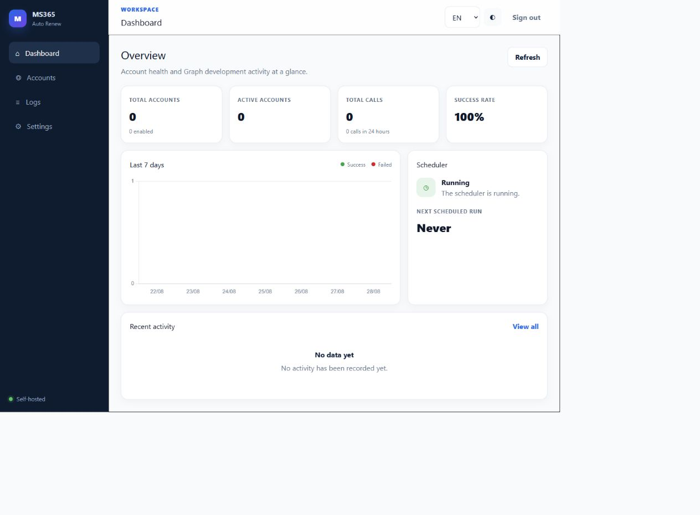

# MS365 Auto Renew 2.0

[Tiếng Việt](README.vi.md) · [Deployment](docs/DEPLOYMENT.md) · [Microsoft Entra setup](docs/ENTRA_SETUP.md) · [Operations](docs/OPERATIONS.md) · [Security](SECURITY.md)

MS365 Auto Renew is a self-hosted WebUI for scheduling development and test workloads that use delegated Microsoft Graph permissions. Version 2.0 provides a secure first-run setup, encrypted token storage, a responsive three-language interface, and reproducible container releases.

> **Important:** this is an independent open-source project. It is not affiliated with or endorsed by Microsoft. It does not guarantee Microsoft 365 Developer Program membership or subscription renewal. Microsoft alone determines eligibility. Use it only with accounts, tenants, and data you are authorized to manage, and follow the applicable Microsoft terms and policies.



## Highlights

- Delegated OAuth only; there is no app-only account mode.
- One-time setup code printed to server logs, 15-minute expiry, one-use semantics, and a 12-character minimum administrator password.
- PBKDF2 password hashes, signed expiring OAuth state, stable encrypted token storage, login/setup throttling, strict redirect origin handling, and no default credentials.
- English by default, plus Vietnamese and Simplified Chinese; locale and theme persist locally.
- Dashboard, accounts, scheduling, execution logs, notification settings, loading/empty/error states, confirmation dialogs, and accessible keyboard focus.
- Local, pinned Tailwind CSS and Chart.js assets; no runtime CDN dependency.
- Repository workflows for Python 3.11/3.12 CI, container smoke tests, dependency/secret/filesystem scanning, and multi-architecture GHCR publishing.

## Quick start with Docker

Requirements: Docker Engine 24+ with Docker Compose v2.

```bash
git clone https://github.com/trquan06/E5-Auto-Renew.git
cd E5-Auto-Renew
cp .env.example .env
docker compose -f compose.build.yml up -d --build
docker compose -f compose.build.yml logs webui
curl --fail http://localhost:8080/health
```

PowerShell uses `Copy-Item .env.example .env`; the remaining Docker commands are the same.

Open `http://localhost:8080`. Copy the one-time setup code from the logs, initialize the administrator password, and then sign in. The code expires after 15 minutes and changes when an incomplete installation restarts.

For the published `ghcr.io/trquan06/e5-auto-renew:2.0.0` image, run:

```bash
docker compose up -d
docker compose logs webui
```

The SQLite database, encryption key, and runtime state live in the Docker-managed `e5_data` volume at `/app/data`. Compose keeps the volume across container recreation. Keep it private and back it up as one unit. If you intentionally replace it with a Linux bind mount, first run `mkdir -p data && sudo chown 10001:10001 data`; never use `chmod 777`.

## Local Python development

Requirements: Python 3.11 or 3.12 and Node.js 20.

```bash
python -m venv .venv
source .venv/bin/activate  # Windows PowerShell: .venv\Scripts\Activate.ps1
pip install -r requirements-dev.txt
npm ci
npm run build
python run.py
```

The first launch prints the setup code in the terminal. Run `pytest -q` for the automated suite.

## Microsoft Entra callback

Create an Entra app registration and add this **Web** redirect URI exactly:

```text
https://YOUR-WEBUI-ORIGIN/api/accounts/oauth/callback
```

For local testing use `http://localhost:8080/api/accounts/oauth/callback`. Configure `PUBLIC_BASE_URL` to the external HTTPS origin when running behind a reverse proxy. Do not add a path or trailing slash. See [the complete delegated-permission guide](docs/ENTRA_SETUP.md).

## Configuration

Copy `.env.example` to `.env`. Important variables:

| Variable | Default | Purpose |
|---|---:|---|
| `HOST_BIND` | `127.0.0.1` | Host interface used by Compose; keep loopback unless a firewall/proxy topology requires otherwise |
| `HOST_PORT` | `8080` | Host port used by Compose |
| `DATA_DIR` | `./data` locally, `/app/data` in Docker | Persistent database and generated encryption key |
| `PUBLIC_BASE_URL` | empty | Exact external WebUI origin used for OAuth redirects |
| `ALLOWED_ORIGINS` | empty | Optional comma-separated additional trusted origins; no wildcards |
| `SECRET_KEY` | generated | Optional durable secret override; changing it invalidates sessions and encrypted tokens |
| `DEFAULT_TIMEZONE` | `UTC` | Default IANA timezone for new schedules |
| `LOG_RETENTION_DAYS` | `30` | Operational log retention target |
| `LOG_LEVEL` | `INFO` | Python application log level |
| `FORWARDED_ALLOW_IPS` | `127.0.0.1` | Explicit proxy IP/CIDR allowlist; `*` is rejected |

`WEBUI_PASSWORD` exists only as a v1 migration bridge. It has no default, is hashed into the database on startup, and should then be removed from the environment.

The internal Python/npm package slugs retain `ms365-auto-renew` for compatibility; repository, folder, container, and GHCR identifiers use E5 Auto Renew.

## Data and security

- Never publish `.env`, `data/renew.db`, `data/secret.key`, database sidecars, logs, tokens, or backups.
- Back up the whole data volume so the database and `secret.key` remain together.
- Put remote deployments behind an HTTPS reverse proxy. `PUBLIC_BASE_URL` must match the browser-visible origin and `FORWARDED_ALLOW_IPS` must name only the proxy IP/CIDR. Keep port 8080 bound to loopback or blocked from the public Internet.
- The application keeps authorization codes only long enough to exchange them and clears them from the callback page and popup message payload.
- Review [SECURITY.md](SECURITY.md) before exposing the service to a network.

## Update, rollback, and backup

Follow [Operations](docs/OPERATIONS.md). In short: back up `/app/data`, pull the new image, recreate the container, verify `/health`, and retain the previous immutable image tag for rollback. Never restore only the database without its matching encryption key.

## Project layout

```text
app/                 FastAPI backend and modular static SPA
tests/               Security, API, scheduler, Graph and UI checks
docs/                Deployment, Entra and operations guides
portainer/           Image and repository-build stack examples
.github/              CI, release publishing and Dependabot
compose.yml           Published-image deployment
compose.build.yml     Local/repository build deployment
```

## Contributing and license

See [CONTRIBUTING.md](CONTRIBUTING.md). This project is released under the [MIT License](LICENSE); dependency license review is recorded in [THIRD_PARTY_NOTICES.md](THIRD_PARTY_NOTICES.md).
